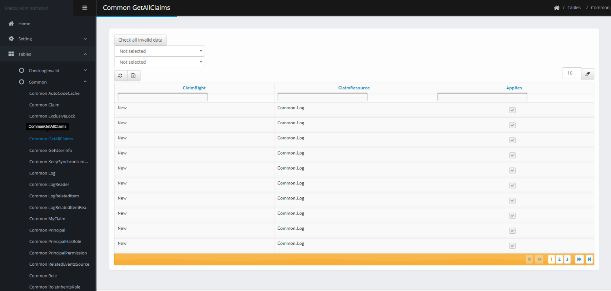

# AdminGui
AdminGui plugin provides a beautiful dashboard to manage data tables of a Rhetos server.

<p align="center">
  <a>
    
  </a>
</p>

# Installation
Head over to [Release section](https://github.com/Rhetos/AdminGui/releases) to download release packages of this plugin or you can clone and [build it from source](https://github.com/Rhetos/AdminGui/tree/master#build-from-source).

After you have the packages, place them inside your Rhetos server or anywhere you desire. Within your `RhetosPackages.config` file, add one more package configuration:
```
<packages>
    <package id="Rhetos.AdminGui"/>
    <package id="Rhetos.AdminGuiCompile"/>
</packages>
```
If the packages are not placed in the same directory as the config file, you also have to specify the `source` attribute of the tags.

# Usage
Coming soon.

# Getting involved
## Prerequisites
To simply build the packages from source:
- [Node.js](https://nodejs.org/en/) and [npm](https://www.npmjs.com/get-npm).
- [MSBuild](https://visualstudio.microsoft.com/downloads/) v10.0+ (also known as Build Tools for Visual Studio)
- [Nuget CLI](https://www.nuget.org/downloads).

If you plan to jump on the development train, welcome onboard! Beside tools above, here are a few more things you are going to need:
- An IDE or a simple text editor (Visual Studio, Visual Studio Code, Sublime, Notepad++, etc.)
- .NET Framework SDK v4.5.1+.

## Build from source
1. Fork the `AdminGui` repository and clone it locally.
2. Ensure you have `nuget` and `npm` commands available at your %PATH%. NuGet version 4.0+ is recommended. Older versions are not tested.
3. Get inside AdminGui directory, run `.\Publish` in Powershell.
4. After it's done, the publish outputs are located inside `PublishOutput` directory.

Note, you can specify a version for the packages by passing the `BuildVersion` parameter to the command. For example, `.\Publish -BuildVersion "1.2.0"`.

## Contributing
1. Fork the `AdminGui` repository and clone it locally.
2. Download and prepare the development environment:
```
.\Init
```
3. After this step, you are ready to begin!
4. Build the latest changes and run a local testing Rhetos server (By default, it is listening on http://localhost:9000).
```
.\Run
```
Please note, we currently do not support hot-reloaded, which means if you make new changes in the source code, you have to stop the server and excute the command `.\Run` again.  

5. And feel free to open issues or pull requests.

## Repository structure
Coming soon.